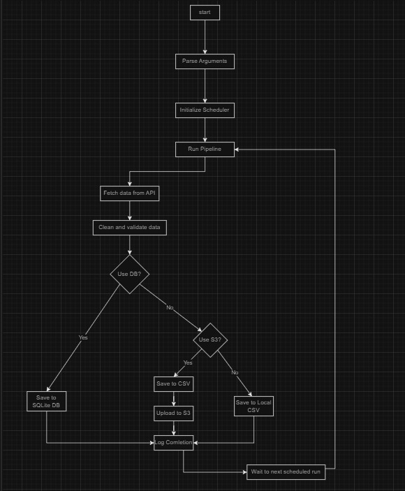

# API Data Pipeline

This project implements a data pipeline that fetches user data from an API, processes it, and saves it to a CSV file.


## Installation

1. Clone this repository
2. Install the required packages

## Overview

This project implements a robust data pipeline that fetches user data from an API, processes it, and saves it to a CSV file, S3 bucket, or SQLite database. It demonstrates best practices in Python programming, data engineering, and ETL (Extract, Transform, Load) processes.

## Features

- Fetches data from a configurable API endpoint
- Cleans and validates the fetched data
- Saves processed data to CSV files locally, in S3, or in a SQLite database
- Implements scheduled execution using APScheduler
- Provides comprehensive logging
- Includes unit tests for key components
- Uses JSON for configuration management
- Supports containerization with Docker

## Prerequisites

- Python 3.7 or higher
- pip (Python package installer)
- Docker (optional, for containerization)
- AWS account (optional, for S3 integration)
- SQLite (included with Python, separate installation not necessary)

## Installation

1. Clone this repository:
   ```
   git clone "https://github.com/EliorTan/Data-Pipeline.git"
   cd Data-Pipeline
   ```

2. Install the required packages:
   ```
   pip install -r requirements.txt
   ```

## Configuration

Edit the `config.json` file to set your desired configuration:

```json
{
    "api": {
        "url": "https://jsonplaceholder.typicode.com/users",
        "timeout": 10
    },
    "output": {
        "prefix": "user_data",
        "format": "csv"
    },
    "schedule": "0 * * * *",
    "aws": {
        "use_s3": false,
        "bucket_name": "your-bucket-name",
        "region": "us-west-2"
    },
    "database": {
        "use_db": false,
        "path": "pipeline_data.db"
    }
}
```

## Usage

### Basic Usage

Run the pipeline with default settings:

```
python main.py
```

This will start the scheduler, which will run the pipeline according to the default schedule (hourly).

### Advanced Usage

Customize the pipeline run with command-line arguments:

```
python main.py --api-url "https://jsonplaceholder.typicode.com/users" --schedule "*/1 * * * *" --use-db
```

- `--api-url`: Set the API endpoint to fetch data from
- `--output-prefix`: Set the prefix for output CSV files
- `--schedule`: Set the cron schedule for pipeline execution
- `--use-db`: Use SQLite database for data storage

### Docker Usage

1. Build the Docker image:
   ```
   docker compose up --build
   ```

2. Run the container:
   ```
   docker compose up
   ```

## AWS S3 Integration

To use S3 for data storage:

1. Ensure you have AWS credentials configured on your system.
2. Set `"use_s3": true` in `config.json` or use the `--use-s3` flag when running the script.

## SQLite Database Usage

When using the `--use-db` flag or setting `"use_db": true` in `config.json`, the pipeline will store data in a SQLite database.

To interact with the SQLite database using the SQLite CLI:

1. Open a terminal or command prompt
2. Navigate to your project directory
3. Run the following command:
   ```
   sqlite3 data/pipeline_data.db
   ```
4. You can now run SQL commands. For example:
   ```sql
   SELECT * FROM users;
   ```
5. To exit the SQLite prompt, use the `.quit` command

Note: To use SQLite CLI you may need to install it separately. (https://www.sqlite.org/download.html)

## Running Tests

To run the unit tests:

```
python -m unittest discover tests
```

## Logging

The pipeline logs its activities to both the console and a file named `pipeline.log` in the project root directory.

## Project Structure

- `main.py`: Entry point of the application
- `pipeline/`: Contains the core pipeline modules
  - `config.py`: Configuration and argument parsing
  - `api_client.py`: Handles API interactions
  - `data_processing.py`: Data processing and pipeline logic
  - `utils.py`: Utility functions for data cleaning and validation
- `tests/`: Contains unit tests
- `requirements.txt`: List of Python package dependencies

## Acknowledgments

- [Requests](https://docs.python-requests.org/) for API interactions
- [pandas](https://pandas.pydata.org/) for data manipulation
- [APScheduler](https://apscheduler.readthedocs.io/) for task scheduling
- [SQLite](https://www.sqlite.org/) for database storage

## UML documentation
